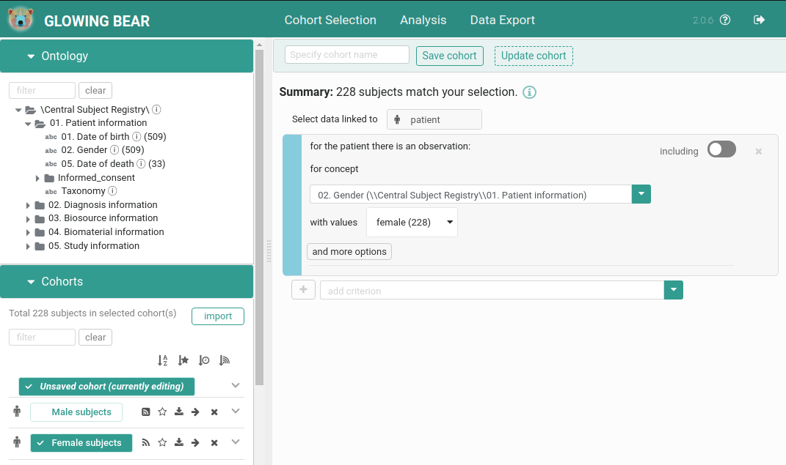

#  Glowing Bear
[](https://travis-ci.com/thehyve/glowing-bear/branches)
[](https://codecov.io/gh/thehyve/glowing-bear)

An [Angular]-based frontend application for clinical data selection and analysis 
based on [TranSMART]. Visit https://glowingbear.app for more information.



## Development

If you are interested in additional features, like visual analytics or using a custom format for data export, 
see the [extentions](#extensions) section for details.

### How to install
* First, make sure the latest [Angular CLI] and [Yarn] are installed globally.

* Second, clone Glowing Bear's code and install its dependencies
    ```
    git clone https://github.com/thehyve/glowing-bear.git
    cd glowing-bear
    yarn
    ```


### How to run locally
We assume that a [tranSMART] backend and [gb-backend] have been installed and run,
either locally, or remotely (follow the links for the information on how to install and run them).

* First, use the configuration for development 
by changing [env.json](src/app/config/env.json) to

    ```json
    {
      "env": "dev"
    }
    ```

* Second, modify [config.dev.json](src/app/config/config.dev.json) 
(see the [configuration](#configuration) section for details).

* Third, run
    ```
    yarn serve
    ```
    The app is run on `https://localhost:4200/` and 
    will automatically reload if you change any of the source files.


### How to build
`yarn build` (or `ng build`)

`yarn package` (or `ng build --prod`)

The build artifacts will be stored in the `dist/` directory.


### How to test
Run `yarn test` to execute the unit tests via [Karma], 
the generated coverage documents can be found in the `coverage/` folder.

#### e2e
For e2e test we use [Cypress] in combination with the [cypress-cucumber-preprocessor].
[Cypress] is install as part of the your `npm install` command. 
To run the tests using the headless browser `npm run e2e` or `npm run cypress` to launch the GUI.

On which environment to run the tests can be changed in cypress.json
Here are settings you would need to modify for that:

| Option | Description |
|:-------|:------------|
| `baseUrl` | URL of the glowingbear to run tests against |
| `fixturesFolder` | Folder with environment specific configurations (e.g. test users credentials), so-called fixtures. e.g. `dev`, `test`. |
| `env.apiUrl` | A transmart backend. It has to be the same that the glowingbear (specified in `baseUrl`) is communicating with. It is used by tests as shortcuts for data preparation and cleaning (e.g. remove export jobs). |
| `env.oidc-server-url` | URL of the identity provider that is used by the glowingbear and transmart. |
| `env.oidc-client-id` | The OpenID Connect Client name. |

:warning: WARNING: tests alter state. All saved queries are deleted.


### How to publish
We use Gradle to create bundles that are suitable for publication:

```bash
# Create a tar bundle in build/distributions
gradle assemble

# Publish the bundle to Nexus
gradle publish
```

The latest release is [glowing-bear-2.0.15.tar](https://repo.thehyve.nl/service/local/repositories/releases/content/nl/thehyve/glowing-bear/2.0.15/glowing-bear-2.0.15.tar).

Published snapshot bundles are available in the `snapshots` repository
on https://repo.thehyve.nl with id `nl.thehyve:glowing-bear:0.0.1-SNAPSNOT:tar`.

Untar the archive in a directory where it can be served by a web server,
e.g. [Apache] or [nginx].


### How to create a release

For creating a new release, increase the version in [package.json](package.json).
Make sure the `publishing.repositories.maven.url` property
in [build.gradle](build.gradle) is set to a release repository.

### Dimension icons

Glowing bear has a list of icons defined for basic subject dimensions:
- patients
- diagnoses
- biosources
- biomaterials
- radiology dimension and images

If there is a new dimension, it will have a default icon. In order to customize this,
for each new dimension that needs to be supported
a new icon has to be added in [icon-helper file](src/app/utilities/icon-helper.ts).

## Extensions

All extensions require a proper configuration, as described in [configuration](#configuration) section.

### Experimental analysis

To use interactive visual analytics, you need to install [Fractalis back-end] and,
either install [Fractalis front-end] from the repository, or use a [`npm` package](https://www.npmjs.com/package/fractalis).

### Export service

To be able to use additional export formats, install [transmart-packer].


## Installation

For installation using *docker-compose*, see [glowing-bear-docker](https://github.com/thehyve/glowing-bear-docker).

For installation using *Puppet*, follow the instructions on [puppet-transmart_core](https://github.com/thehyve/puppet-transmart_core).

*Manual installation* is explained in the [installation instructions](docs/installation.md).


## Configuring Glowing Bear

The application can be configured by changing the `env.json` and `config.*.json`
files in `app/config`.

Example `env.json` (allowed values are `default`, `dev` and `transmart`):

```json
{
  "env": "default"
}
```
Example `config.default.json`:

```json
{
  "api-url": "/api/transmart-api-server",
  "api-version": "v2",
  "gb-backend-url": "/api/gb-backend",
  "doc-url": "https://glowingbear.app",
  "enable-fractalis-analysis": false,
  "autosave-subject-sets": true,
  "show-observation-counts": false,
  "instant-counts-update": false,
  "include-data-table": false,
  "include-cohort-subscription": false,
  "oidc-server-url": "${KEYCLOAK_SERVER_URL}/realms/${KEYCLOAK_REALM}/protocol/openid-connect",
  "oidc-client-id": "${KEYCLOAK_CLIENT_ID}",
  "export-mode": {
    "name": "packer",
    "data-view": "basic_export",
    "export-url": "/api/transmart-packer"
  },
  "check-server-status": true
}
```

Supported properties in the `config.*.json` files:

| Property                  | Default   | Description |
|:------------------------- |:--------- |:----------- |
| `api-url`                 |           | URL of the TranSMART API to connect to. |
| `api-version`             | `v2`      | TranSMART API version. Only `v2` is supported. |
| `gb-backend-url`          |           | URL of the Gb-backend application to connect to for cohorts handling. |
| `autosave-subject-sets`   | `false`   | Persist subject selection as subject set automatically. |
| `show-observation-counts` | `true`    | |
| `instant-counts-update` | `false`   | |
| `oidc-server-url`         |           | E.g., `https://keycloak.example.com/auth/realms/{realm}/protocol/openid-connect` |
| `oidc-client-id`          | `transmart` | |
| `export-mode`             |           | JSON object. Data export configuration. When using tranSMART directly, use: `export-mode`: { `name`: `transmart`, `data-view`: `export-data-view` }, where `export-data-view` defines a shape of the export (`dataTable`, `surveyTable`). When using external tool called `transmart-packer`, use: `export-mode`: { `name`: `packer`, `data-view`: `packer-job-name`, `export-url`:`http://example.com`, where `packer-job-name` is a name of the job in `transmart-packer` and `export-url` is an URL of `transmart-packer` } |
| `enable-fractalis-analysis` | `false`   | Enable the Fractalis visual analytics in the `analysis` tab.
| `fractalis-url`           |           | URL of the Fractalis application to connect to for visual analytics.
| `fractalis-datasource-url`|           | The URL where the TranSMART API is reachable by Fractalis. (The value for `api-url` is used by default).
| `include-data-table`      | `true`    | Show a data table in the export tab.
| `include-cohort-subscription` | `false` | Enable cohort subscription.
| `check-server-status` | `false` | Enable checking server status before requesting data.
| `deny-access-to-users-without-role` | `false` | Deny access to users without any roles assigned to them. The corresponding configuration needs to be set for the backends.


## License

Copyright &copy; 2017&ndash;2021 &nbsp; The Hyve B.V.

This program is free software: you can redistribute it and/or modify
it under the terms of the [Mozilla Public License 2.0](LICENSE).

You should have received a copy of the license along with this program. 
If not, see https://opensource.org/licenses/MPL-2.0.


[tranSMART]: https://github.com/thehyve/transmart-core
[gb-backend]: https://github.com/thehyve/gb-backend
[Fractalis front-end]: https://github.com/thehyve/Fractal.js
[Fractalis back-end]: https://github.com/thehyve/Fractalis
[transmart-packer]: https://github.com/thehyve/transmart-packer
[Angular]: https://github.com/angular/angular
[Angular CLI]: https://github.com/angular/angular-cli
[Yarn]: https://yarnpkg.com/en/docs/install
[Karma]: https://karma-runner.github.io
[cucumber-js]: https://github.com/cucumber/cucumber-js
[nginx]: https://nginx.org
[Apache]: https://httpd.apache.org
[Cypress]: https://www.cypress.io/
[cypress-cucumber-preprocessor]: https://github.com/TheBrainFamily/cypress-cucumber-preprocessor
[transmart-api-server]: https://github.com/thehyve/transmart-core/tree/dev/transmart-api-server
