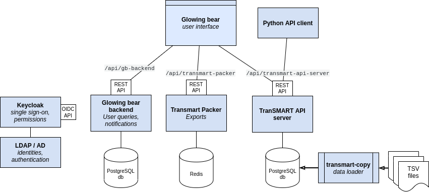

# Installation instructions for Glowing Bear

## Installation using Docker

For installation using docker-compose, see [glowing-bear-docker](https://github.com/thehyve/glowing-bear-docker).

## Installation using Puppet

For installation using Puppet, follow the instructions on [puppet-transmart_core](https://github.com/thehyve/puppet-transmart_core).

## Manual installation

This section contains instructions for setting up:
- Keycloak and its database;
- The backend services `transmart-api-server`, `gb-backend` and `transmart-packer`,
  and their databases;
- An nginx web server that serves the Glowing Bear application and functions as a gateway for the backend services. The web server also provides the SSL secured access.



### Keycloak

The official installation documentation for Keycloak is available on the [Keycloak documentation site](https://www.keycloak.org/docs/latest/server_installation/index.html#installation).

The instructions here describe installation of a new distribution named *Keycloak.X*, running on a Quarkus JVM (embedded), which is easier to configure and runs faster than the traditional version.

Keycloak requires:
- a PostgreSQL database server

Installation steps for Keycloak:

1. Create a database `keycloak` and a role `keycloak` granted all privileges on the database. Choose a strong password for the role. The password must not contain whitespace.

   ```postgresql
   create database keycloak;
   create role keycloak with password 'choose-a-strong-keycloak-password' login;
   grant all on database keycloak to keycloak;
   ```

2. Ensure that a system user `keycloak` exists with home directory `/home/keycloak`.
   ```shell
   adduser --system keycloak
   ```

3. Download the Keycloak.X preview release from: https://github.com/keycloak/keycloak/releases.

   Commands to download and configure in `/home/keycloak`:
   ```shell
   KEYCLOAK_VERSION=12.0.4
   curl -f -L "https://github.com/keycloak/keycloak/releases/download/${KEYCLOAK_VERSION}/keycloak.x-preview-${KEYCLOAK_VERSION}.tar.gz" -o "keycloak.x-preview-${KEYCLOAK_VERSION}.tar.gz"
   tar xfz "keycloak.x-preview-${KEYCLOAK_VERSION}.tar.gz"
   cd "keycloak.x-${KEYCLOAK_VERSION}"

   KEYCLOAK_SERVER_URL=https://keycloak.example.com  # CHANGE ME
   KEYCLOAK_DB_PASSWORD=choose-a-strong-keycloak-password  # CHANGE ME
   KEYCLOAK_DB_PORT=5432
   bin/kc.sh config --http-enabled=true --metrics-enabled=true \
     --features-account2=disabled --features-token_exchange=enabled \
     --db=postgres -Dkc.db.url.host="localhost:${KEYCLOAK_DB_PORT:-5432}" --db-username=keycloak --db-password=${KEYCLOAK_DB_PASSWORD} \
     --hostname-frontend-url=${KEYCLOAK_SERVER_URL}/
   ```

4. Create a systemd service `/etc/systemd/system/keycloak.service`:
   ```ini
   [Unit]
   Description=Keycloak server
   After=syslog.target network.target

   [Service]
   User=keycloak
   ExecStart=/home/keycloak/keycloak.x-12.0.4/bin/kc.sh
   StandardOutput=journal+console
   Restart=always

   [Install]
   WantedBy=multi-user.target
   ```

   Ensure the `keycloak` user has write access to: `/tmp/kc-gzip-cache/` and `/tmp/vertx-cache/`.

5. Start the Keycloak service:
   ```shell
   systemctl start keycloak.service
   ```

6. Connect to the service at http://localhost:8080 to configure an admin account (when installing on a remote machine, create an SSL tunnel).

7. Setup an SSL proxy. E.g., with nginx, create a file `/etc/nginx/sites-enabled/keycloak.conf`:
   ```nginx
   server {
     listen                *:443 ssl;
     server_name           keycloak.example.com;
     ssl_certificate       /etc/ssl/certs/keycloak.example.com.pem;
     ssl_certificate_key   /etc/ssl/private/keycloak.example.com.key;
     index                 index.html;
     access_log            /var/log/nginx/keycloak.example.com:443.access.log combined;
     error_log             /var/log/nginx/keycloak.example.com:443.error.log;

     location / {
       proxy_pass            http://localhost:8080;
       proxy_read_timeout    90s;
       proxy_connect_timeout 90s;
       proxy_send_timeout    90s;
       proxy_set_header      Host $host;
       proxy_set_header      X-Real-IP $remote_addr;
       proxy_set_header      X-Forwarded-For $proxy_add_x_forwarded_for;
       proxy_set_header      X-Forwarded-Proto $scheme;
       proxy_set_header      Proxy "";
     }
   }
   ```
   Note that Keycloak requires the `X-Forwarded-For` and `X-Forwarded-Proto` headers to be set correctly.
   Please ensure that proper SSL certificates are installed.

7. Reload nginx configuration:
   ```shell
   systemctl reload nginx.service
   ```

#### Configure Keycloak

Below are steps on how to set up Keycloak for Glowing Bear/TranSMART using the admin console.
The prerequisite is to have admin credentials to a Keycloak instance.
Login to `https://keycloak.example.com/admin/` and:

1. Create a realm, e.g., `example`

2. Create a client `transmart-client`:
   - Client Protocol: `openid-connect`
   - Root URL: `https://glowingbear.example.com`
   - Access Type: `public`
   - Standard Flow Enabled: `On`
   - Implicit Flow Enabled: `On`
   - Root URL: `https://glowingbear.example.com`
   - Valid Redirect URIs: `/*`
   - Base URL: `/`
   - Web Origins: `https://glowingbear.example.com`

3. Add a client mapper to include an `aud` (audience) claim to the token (see the [official Keycloak documentation](https://www.keycloak.org/docs/6.0/server_admin/#_audience_hardcoded)).
   - Go to `Clients`, select `transmart-client`, and select the `Mappers` tab.

     > 
   - Click `Create`, type name `transmart-client-audience`, select mapper type `Audience`, select the included client audience: `transmart-client`, and click `Save`.

     > 

3. Create administrator role:
   - Follow `Clients > transmart-client > Roles` (tab)
   - Create client role `ROLE_ADMIN`:

     > 

4. Add users\
   Keycloak supports [identity brokering](https://www.keycloak.org/docs/latest/server_admin/index.html#_identity_broker), or [user federation](https://www.keycloak.org/docs/latest/server_admin/index.html#_user-storage-federation) for integration with existing organisational identity providers.\
   To add users manually:
   - Go to `Users`
   - Click `Add user`, enter a username and click `Save`.
   - Select the `Credentials` tab, enter a password and click `Reset Password`.
   - If the user should have administrator access:
     - Go to `Role Mappings` tab.
     - Then select `transmart-client` in the `Client Roles` dropdown and assure that `ROLE_ADMIN` is in the list of assigned roles.

5. Add a system user for asynchronous job handling by the Glowing Bear backend Transmart Packer.
   - Go to `Users`
   - Click `Add user`, enter username `system` and click `Save`.
   - Select the `Credentials` tab, enter a strong password and click `Reset Password`.
   - Go to `Role Mappings` tab.
     - Ensure that the `offline_access` realm role is assigned.
     - Select `realm-management` in the `Client Roles` dropdown and assure the `view-users` and `impersonation` roles are assigned.

     > 

#### Offline token

Request an offline token for the `system` user, to be used by Glowing Bear backend and Transmart Packer. 

```bash
KEYCLOAK_CLIENT_ID=transmart-client
SYSTEM_USERNAME=system
SYSTEM_PASSWORD=choose-a-strong-system-password # CHANGE ME
KEYCLOAK_SERVER_URL=https://keycloak.example.com
KEYCLOAK_REALM=example

curl -f --no-progress-meter \
  -d "client_id=${KEYCLOAK_CLIENT_ID}" \
  -d "username=${SYSTEM_USERNAME}" \
  -d "password=${SYSTEM_PASSWORD}" \
  -d 'grant_type=password' \
  -d 'scope=offline_access' \
  "${KEYCLOAK_SERVER_URL}/realms/${KEYCLOAK_REALM}/protocol/openid-connect/token" | jq -r '.refresh_token'
```

The value of the `refresh_token` field in the response is the offline token.

#### Availability check for monitoring

Availability of the Keycloak application can be tested using the following public endpoints:
- The realm specific endpoint `/realms/example/.well-known/openid-configuration` should return status `200`.
- The health endpoint `/health` should return a JSON message with value `UP` in the `status` field:
  ```json
  {
    "status": "UP",
    "checks": [
      {
        "name": "Keycloak database connections health check",
        "status": "UP"
      }
    ]
  }
  ```

### TranSMART API server and database

TranSMART API server requires:
- JDK 8
- a PostgreSQL database server

Installation steps for TranSMART API server:

1. Install the `pg_bitcount` extension, e.g., for PostgreSQL 12:
   ```shell
   POSTGRESQL_VERSION=12
   curl -f -L -o postgresql-${POSTGRESQL_VERSION}-pg-bitcount_0.0.3-2_amd64.deb \
     https://github.com/thehyve/pg_bitcount/releases/download/0.0.3-2/postgresql-${POSTGRESQL_VERSION}-pg-bitcount_0.0.3-2_amd64.deb && \
   sudo dpkg -i postgresql-${POSTGRESQL_VERSION}-pg-bitcount_0.0.3-2_amd64.deb
   ```

2. Create a database `transmart` a role `biomart_user` granted all privileges on the database. Choose a strong password for the `biomart_user` role.

   ```postgresql
   create database transmart;
   create role biomart_user with password 'choose-a-strong-transmart-password' login;  -- CHANGE ME
   grant all on database transmart to biomart_user;
   ```
   Install the `pg_bitcount` extension using `sudo -u postgres psql -d transmart`:
   ```postgresql
   create extension pg_bitcount version '0.0.3';
   select extname, extversion from pg_extension where extname = 'pg_bitcount';
   ```
   Expected output:
   ```
      extname   | extversion 
   -------------+------------
    pg_bitcount | 0.0.3
   (1 row)
   ```

3. Ensure that a system user `transmart` exists with home directory `/home/transmart`.
   ```shell
   adduser --system transmart
   ```

4. Download the application in the `/home/transmart` directory:
   ```shell
   TRANSMART_VERSION=17.2.11
   curl -f -L -o "/home/transmart/transmart-api-server-${TRANSMART_VERSION}.war" \
     "https://repo.thehyve.nl/service/local/repositories/releases/content/org/transmartproject/transmart-api-server/${TRANSMART_VERSION}/transmart-api-server-${TRANSMART_VERSION}.war"
    ```

5. Create config file `/home/transmart/transmart-api-server.config.yml`:
   ```yaml
   dataSource:
     driverClassName: org.postgresql.Driver
     dialect: org.hibernate.dialect.PostgreSQLDialect
     url: jdbc:postgresql://localhost:5432/transmart?currentSchema=public
     username: biomart_user
     password: choose-a-strong-transmart-password  # CHANGE ME
     dbCreate: none
     pooled: true
     jmxExport: true
     logSql: false
     formatql: false
     properties:
       minimumIdle: 15
       maximumPoolSize: 50

   keycloak:
     auth-server-url: https://keycloak.example.com  # CHANGE ME
     realm: example  # CHANGE ME
     resource: transmart-client
     bearer-only: true
     use-resource-role-mappings: true
     verify-token-audience: true

   org.transmartproject.system.numberOfWorkers: 2
   org.transmartproject.patientCountThreshold: 0

   grails.plugin.databasemigration:
     updateOnStartFileName: classpath:db/changelog/db.changelog-master.yaml
     updateOnStart: true  # If true, schema update scripts are executed at startup

   org.transmartproject.system.writeLogToDatabase: false  # write log messages to the searchapp.search_app_access_log table
   ```

5. Create a systemd service `/etc/systemd/system/transmart-api-server.service`:
   ```ini
   [Unit]
   Description=TranSMART API server
   After=syslog.target network.target

   [Service]
   User=transmart
   WorkingDirectory=/home/transmart
   ExecStart=java -jar -server -Xms8g -Xmx8g -Djava.awt.headless=true -Dorg.apache.jasper.runtime.BodyContentImpl.LIMIT_BUFFER=true -Dmail.mime.decodeparameters=true  -Dserver.port=8081 -Djava.security.egd=file:///dev/urandom -Dspring.config.location=/home/transmart/transmart-api-server.config.yml /home/transmart/transmart-api-server-17.2.11.war
   StandardOutput=journal+console
   Restart=always

   [Install]
   WantedBy=multi-user.target
   ```

6. Start the service:
   ```shell
   systemctl start transmart-api-server.service
   ```


### Glowing Bear backend

The Glowing Bear backend server requires:
- JDK 8
- a PostgreSQL database server
- an SMTP email server

Installation steps for the Glowing Bear backend server:

1. Create a database `gb` a role `biomart_user` granted all privileges on the database. Choose a strong password for the `biomart_user` role.

   ```postgresql
   create database gb_backend;
   create role gb_backend with password 'choose-a-strong-gb_backend-password' login;  -- CHANGE ME
   grant all on database gb_backend to gb_backend;
   ```

2. Ensure that a system user `gb` exists with home directory `/home/gb`.
   ```shell
   adduser --system gb
   ```

3. Download the application in the `/home/gb` directory:
   ```shell
   GB_BACKEND_VERSION=1.0.6
   curl -f -L -o "/home/gb/gb-backend-${GB_BACKEND_VERSION}.war" \
     "https://repo.thehyve.nl/service/local/repositories/releases/content/nl/thehyve/gb-backend/${GB_BACKEND_VERSION}/gb-backend-${GB_BACKEND_VERSION}.war"
    ```

4. Ensure that you have a valid offline token, for asynchronous data access. See [Offline token](#offline-token).

5. Create configuration file `/home/gb/application.yml`:
   ```yaml
   transmart:
     server-url: http://localhost:8081
     api-version: v2

   keycloak:
     auth-server-url: https://keycloak.example.com  # CHANGE ME
     realm: example  # CHANGE ME
     resource: transmart-client
   keycloakOffline:
     offlineToken: <OFFLINE TOKEN FOR ASYNCHRONOUS ACCESS TO TRANSMART SERVER>  # CHANGE ME

   dataSource:
     driverClassName: org.postgresql.Driver
     dialect: org.hibernate.dialect.PostgreSQLDialect
     username: gb_backend
     password: choose-a-strong-gb_backend-password  # CHANGE ME
     url: jdbc:postgresql://localhost:5432/gb_backend
  
   nl.thehyve.gb.backend.notifications:
     # enable daily and weekly notification jobs
     enabled: true
     # max number of query sets returned in a subscription email
     maxNumberOfSets: 20
     # daily cron job trigger time in format: hh-mm
     # hh: Hour, range: 0-23;
     # mm: Minute, range: 0-59;
     dailyJobTriggerTime: 13-0
     # Name of the client application on behalf of which gb-backend will send notification email.
     clientApplicationName: Glowing Bear  # CHANGE ME
     clientApplicationUrl: https://glowingbear.example.com  # CHANGE ME

   grails:
     mail:
       'default':
         from:  noreply@localhost    # CHANGE ME
   ```

6. Create a systemd service `/etc/systemd/system/gb-backend.service`:
   ```ini
   [Unit]
   Description=Glowing Bear backend server
   After=syslog.target network.target

   [Service]
   User=gb
   WorkingDirectory=/home/gb
   ExecStart=java -jar -server -Djava.awt.headless=true -Dmail.mime.decodeparameters=true -Djava.security.egd=file:///dev/urandom -Dserver.port=8083 -Dspring.config.location=/home/gb/application.yml /home/gb/gb-backend-1.0.6.war
   StandardOutput=journal+console
   Restart=always

   [Install]
   WantedBy=multi-user.target
   ```

7. Start the service:
   ```shell
   systemctl start gb-backend.service
   ```

### Transmart Packer (export services)

Transmart Packer consists of a worker service that performs the export tasks
and a webapp services that handles export requests, task management and export file downloads.

Transmart Packer requires:
- Python 3.7 or newer
- Redis server

Installation steps for the Transmart Packer services:

1. Ensure that a system user `packer` exists with home directory `/home/packer`.
   ```shell
   adduser --system packer
   ```

2. Create a Python 3 virtual environment in `/home/packer/venv`:
   ```shell
   python3 -m venv venv
   ```

3. Install Transmart Packer:
   ```bash
   source venv/bin/activate
   pip install --no-cache-dir --upgrade "transmart-packer == 0.6.1"
   ```

4. Ensure that you have a valid offline token, for asynchronous data access. See [Offline token](#offline-token).

5. Create a start script `/home/packer/start` with the configuration:
   ```bash
   #!/usr/bin/env bash
   set -e
   here=$(dirname "${0}")
   source ${here}/venv/bin/activate

   export KEYCLOAK_SERVER_URL=https://keycloak.example.com  # CHANGE ME
   export KEYCLOAK_REALM=example  # CHANGE ME
   export KEYCLOAK_CLIENT_ID=transmart-client
   export KEYCLOAK_OFFLINE_TOKEN="<offline token>"  # CHANGE ME
   export TRANSMART_URL=http://localhost:8081
   export REDIS_URL=redis://localhost:6379
   export DATA_DIR=/home/packer/data
   export CLIENT_ORIGIN_URL='*'
   export VERIFY_CERT=true

   exec "$@"
   ```

6. Create a systemd service `/etc/systemd/system/transmart-packer-worker.service`:
   ```ini
   [Unit]
   Description=Transmart Packer worker
   After=syslog.target network.target

   [Service]
   User=packer
   WorkingDirectory=/home/packer
   ExecStart=/home/packer/start celery -A packer.tasks worker -c 4 --loglevel info
   StandardOutput=journal+console
   Restart=always

   [Install]
   WantedBy=multi-user.target
   ```

7. Create a systemd service `/etc/systemd/system/transmart-packer-webapp.service`:
   ```ini
   [Unit]
   Description=Transmart Packer web app
   After=syslog.target network.target

   [Service]
   User=packer
   WorkingDirectory=/home/packer
   ExecStart=/home/packer/start transmart-packer
   StandardOutput=journal+console
   Restart=always

   [Install]
   WantedBy=multi-user.target
   ```

8. Start the services:
   ```shell
   systemctl start transmart-packer-worker.service
   systemctl start transmart-packer-webapp.service
   ```


### Glowing Bear

Glowing Bear requires:
- nginx

1. Download the application and extract the contents in the `/var/www/glowingbear` directory:
   ```shell
   GLOWING_BEAR_VERSION=2.0.16
   curl -f -L -o "glowing-bear-${GLOWING_BEAR_VERSION}.tar" \
     "https://repo.thehyve.nl/service/local/repositories/releases/content/nl/thehyve/glowing-bear/${GLOWING_BEAR_VERSION}/glowing-bear-${GLOWING_BEAR_VERSION}.tar"
   sudo mkdir -p /var/www/glowingbear
   sudo tar xf glowing-bear-${GLOWING_BEAR_VERSION}.tar -C /var/www/glowingbear
   ```

2. Override environment file `/var/www/glowingbear/glowing-bear-2.0.16/app/config/env.json` with the following:
   ```json
   {
      "env": "default"
   }
   ```

3. Edit configuration file `/var/www/glowingbear/glowing-bear-2.0.16/app/config/config.default.json` (overwrites the default config file in the `tar`):
   ```json
   {
     "oidc-server-url": "CHANGE ME",
     "oidc-client-id": "transmart-client",
     "api-url": "/api/transmart-api-server",
     "gb-backend-url": "/api/gb-backend",
     "export-mode": {
       "name": "packer",
       "data-view": "csr_export",
       "export-url": "/api/transmart-packer"
     },
     "enable-fractalis-analysis": false,
     "fractalis-url": null,
     "fractalis-datasource-url": "/api/transmart-api-server",
     "autosave-subject-sets": false,
     "show-observation-counts": false,
     "instant-counts-update": false,
     "include-data-table": false,
     "include-cohort-subscription": true,
     "check-server-status": true,
     "deny-access-to-users-without-role": false,
     "api-version": "v2",
     "doc-url": "https://glowingbear.app"
   }
   ```
   The `oidc-server-url` should be of the form `https://keycloak.example.com/realms/example/protocol/openid-connect`.

4. Configure a web server to serve the application and to function as a gateway for the backend services
   E.g., with nginx, create a file `/etc/nginx/sites-enabled/glowingbear.conf`:
   ```nginx
   server {
     listen                *:443 ssl;
     server_name           glowingbear.example.com;  # CHANGE ME
     ssl_certificate       /etc/ssl/certs/glowingbear.example.com.pem;
     ssl_certificate_key   /etc/ssl/private/glowingbear.example.com.key;
     index                 index.html;
     access_log            /var/log/nginx/glowingbear.example.com:443.access.log combined;
     error_log             /var/log/nginx/glowingbear.example.com:443.error.log;

     location / {
       root /var/www/glowingbear/glowing-bear-2.0.16;
       index index.html index.htm;
       try_files $uri $uri/ /index.html =404;
     }
  
     location /api/transmart-api-server/ {
       proxy_pass            http://localhost:8081/;
       proxy_read_timeout    90s;
       proxy_connect_timeout 90s;
       proxy_send_timeout    90s;
       proxy_set_header      X-Real-IP $remote_addr;
       proxy_set_header      X-Forwarded-For $proxy_add_x_forwarded_for;
       proxy_set_header      Proxy "";
       proxy_redirect        default;
     }

     location /api/gb-backend/ {
       proxy_pass            http://localhost:8083/;
       proxy_read_timeout    90s;
       proxy_connect_timeout 90s;
       proxy_send_timeout    90s;
       proxy_set_header      X-Real-IP $remote_addr;
       proxy_set_header      X-Forwarded-For $proxy_add_x_forwarded_for;
       proxy_set_header      Proxy "";
       proxy_redirect        default;
     }

     location /api/transmart-packer/ {
       proxy_pass            http://localhost:8999/;
       proxy_read_timeout    90s;
       proxy_connect_timeout 90s;
       proxy_send_timeout    90s;
       proxy_set_header      X-Real-IP $remote_addr;
       proxy_set_header      X-Forwarded-For $proxy_add_x_forwarded_for;
       proxy_set_header      Proxy "";
       proxy_redirect        default;
     }
   }
   ```
   Please ensure that proper SSL certificates are installed.

5. Reload nginx configuration:
   ```shell
   systemctl reload nginx.service
   ```

#### Availability check for monitoring

Availability of the Transmart API and GB backend applications can be tested using the following public endpoints:
- *Transmart API server*: the health endpoint `/api/transmart-api-server/health` should return status `200` and a JSON message with value `UP` in the `status` field:
  ```json
  {
    "status": "UP"
  }
  ```
- *Glowing Bear backend*: the health endpoint `/api/gb-backend/health` should return status `200` and a JSON message with value `UP` in the `status` field:
  ```json
  {
    "status": "UP"
  }
  ```
- *Transmart Packer*: no health endpoint
